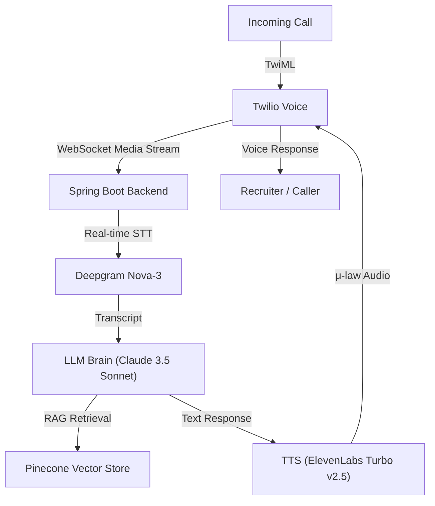

# 🎙️ AI Call Screener & Interview Simulator

**AI Call Screener** is a production-grade AI agent designed to intercept recruiter calls and answer questions on your behalf. By leveraging advanced LLMs and real-time audio processing, it acts as a digital proxy that understands your professional background and handles phone screenings autonomously.

---

## 🏗️ Architecture

The system utilizes a high-concurrency, low-latency AI pipeline to ensure natural-sounding conversations:



---

## ✨ Key Features

- **Live Call Hand-off**: Seamlessly transfer calls between you and the AI agent via the dashboard or keypad shortcuts.
- **Interruptible Speech**: The AI stops speaking instantly when the caller speaks, mimicking human conversation patterns.
- **RAG-Powered Memory**: Ingests call transcripts into Pinecone after each interaction to improve context over time.
- **AI DNA Configuration**: Refine responses using the `ai_dna.txt` system prompt and `resume.json` knowledge base.
- **High Concurrency**: Built with Java 21 Virtual Threads (Project Loom) to handle multiple simultaneous calls effortlessly.

---

## 🛠️ Technology Stack

| Layer | Technology |
|-------|------------|
| **Frontend** | React, Vite, Framer Motion, Vanilla CSS (Glassmorphism) |
| **Backend** | Spring Boot 3.2, Java 21, Project Loom |
| **Voice Processing** | Twilio Media Streams (WebSocket) |
| **Speech-to-Text** | Deepgram Nova-3 |
| **LLM** | Anthropic Claude 3.5 Sonnet |
| **Text-to-Speech** | ElevenLabs Turbo v2.5 |
| **Vector DB** | Pinecone |

---

## ⚙️ Setup & Installation

### 1. Prerequisites
- **Java 21** (JDK)
- **Node.js 20+**
- **Twilio Account** (with a phone number)
- **API Keys**: Deepgram, Anthropic, ElevenLabs, Pinecone

### 2. Environment Configuration

**Clone the repository:**
```bash
git clone https://github.com/dhonitheja/Ai-calling-assistance.git
cd Ai-calling-assistance
```

**Backend Configuration (`backend/src/main/resources/application.yml`):**
Fill in your API keys and Twilio credentials.

**Frontend Configuration (`frontend/.env`):**
```env
VITE_API_BASE_URL=http://localhost:8080
```

### 3. Running Locally

**Start the Backend:**
```bash
cd backend
mvn spring-boot:run
```

**Start the Frontend:**
```bash
cd frontend
npm install
npm run dev
```

**Webhook Connection:**
Use `ngrok` or `localtunnel` to expose port 8080 and set the Twilio Voice Webhook to:
`https://your-public-url.ngrok-free.app/api/calls/incoming`

---

## 🚢 Deployment

**Docker Build:**
Both `frontend/` and `backend/` contain production-ready Dockerfiles.

1. **Backend**: Build and deploy to GCP Cloud Run or AWS App Runner.
2. **Frontend**: Build (`npm run build`) and serve via Nginx (included in Dockerfile) or deploy to Vercel/Netlify.

---

## 📝 License
Distributed under the MIT License.
