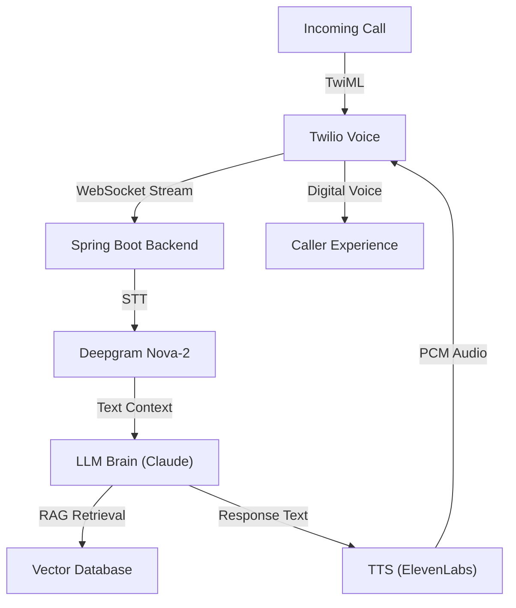

# 🎙️ AI Call Screener & Interview Simulator

**AI Call Screener** is a production-grade AI agent designed to intercept recruiter calls and answer questions on your behalf. By leveraging advanced LLMs and real-time audio processing, it acts as a digital proxy that understands your professional background and handles phone screenings autonomously.

---

## 🏗️ Architecture

The system utilizes a high-concurrency, low-latency AI pipeline to ensure natural-sounding conversations:



---

## ✨ Key Features

- **Command Center**: Real-time dashboard for monitoring call interceptions, latency tracking, and system health.
- **AI Training Studio (RAG)**: A dedicated environment to build your "AI DNA". Upload your experience data and refine AI responses for 25+ common interview scenarios.
- **Interview Mode**: A high-fidelity simulator for practicing interviews against an AI that mimics real recruiter behavior.
- **Toll-Free Integration**: Automated Twilio webhook handling for seamless call routing.

---

## 🛠️ Technology Stack

| Layer | Technology |
|-------|------------|
| **Frontend** | Next.js 14 (App Router), React, Framer Motion, CSS Modules |
| **Backend** | Spring Boot 3.2, Java 21, Project Loom (Virtual Threads) |
| **Speech-to-Text** | Deepgram Nova-2 (WebSocket Real-time) |
| **LLM** | Anthropic Claude 3.5 Sonnet / GPT-4o |
| **Text-to-Speech** | ElevenLabs Turbo v2.5 |
| **Vector DB** | Pinecone |

---

## ⚙️ Setup & Installation

### 1. Prerequisites
- Java 21 (JDK)
- Node.js 20+
- Twilio Account (for phone number and webhooks)
- API Keys for Deepgram, Anthropic, ElevenLabs, and Pinecone

### 2. Environment Configuration

**Frontend (`voice-ai-agent/.env.local`):**
```env
NEXT_PUBLIC_BACKEND_URL=http://localhost:8080
ANTHROPIC_API_KEY=your_anthropic_key
DEEPGRAM_API_KEY=your_deepgram_key
ELEVENLABS_API_KEY=your_elevenlabs_key
PINECONE_API_KEY=your_pinecone_key
```

**Backend (`backend/src/main/resources/application.yml`):**
Configure your Twilio credentials and service endpoints in the YAML configuration.

### 3. Running Locally

**Start the Backend:**
```bash
cd backend
./mvnw spring-boot:run
```

**Start the Frontend:**
```bash
cd voice-ai-agent
npm install
npm run dev
```

---

## 🚢 Deployment

The application is container-ready and can be deployed to any major cloud provider (GCP Cloud Run, AWS App Runner, etc.).

**Basic Deployment Steps:**
1. Build the Docker images for both frontend and backend.
2. Push to a Container Registry.
3. Deploy as a serverless service or to a Kubernetes cluster.
4. Set the Twilio voice webhook to your deployed backend URL: `https://your-api-domain.com/api/calls/incoming`.

---

## 📝 License
Distributed under the MIT License.
