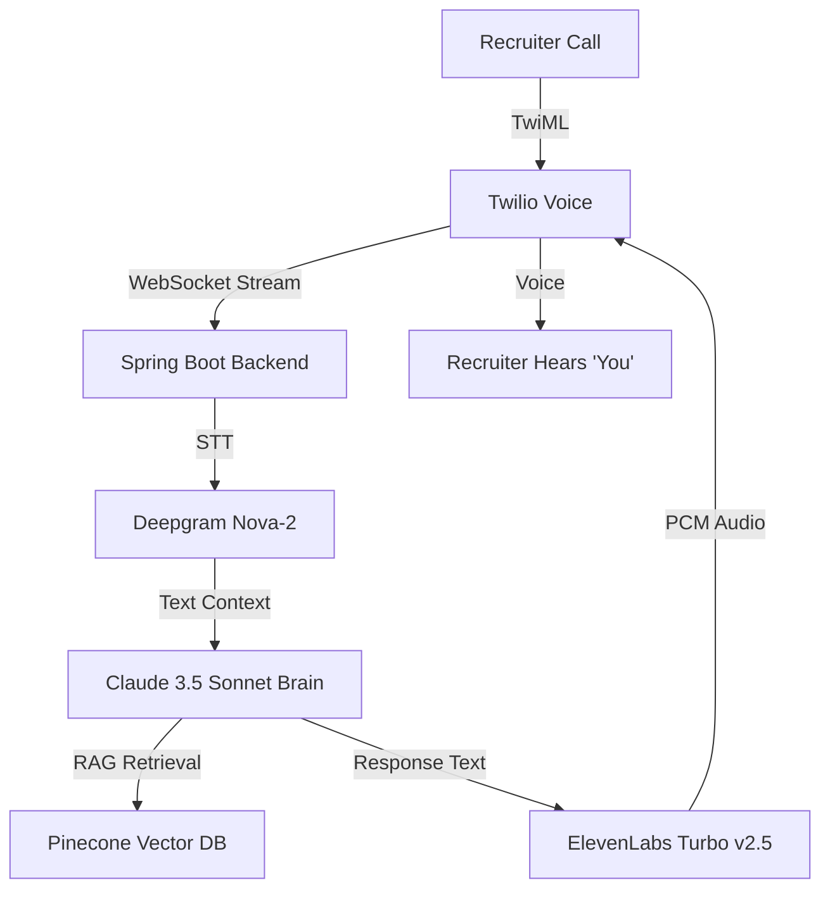

# 🎙️ AI Call Screener & Interview Simulator

> **Elevate your job search with a production-grade AI agent that intercepts recruiter calls, answers questions using your live resume context, and trains on your past experiences.**

 *(Note: Replace with actual screenshot path if available)*

---

## 🚀 Live Production Instance
- **Frontend Dashboard**: [https://callscreen-frontend-166891801449.us-central1.run.app](https://callscreen-frontend-166891801449.us-central1.run.app)
- **Voice AI Webhook**: `https://callscreen-backend-166891801449.us-central1.run.app/api/calls/incoming`
- **Phone Number**: `+1 (855) 769-2480` (Toll-Free AI Agent)

---

## 🏗️ System Architecture

The project is built on a high-concurrency, low-latency AI pipeline:



---

## ✨ Key Features

### 🕹️ Command Center
A high-tech dashboard for monitoring live call interceptions, tracking latency spikes, and managing system status (Emergency Stop / Cluster Start).

### 🧪 AI Training Studio (RAG)
Build your "AI DNA". Upload your resume and use the Training Studio to:
- Refine 25+ pre-built interview questions.
- Use **Claude 3.5 Sonnet** to "AI Improve" your answers for natural phone conversation.
- **⚡ Deploy to Live AI**: Instantly update the RAG context in Cloud Run without redeploying code.

### 🎭 Interview Mode
Practice your own interview skills against a high-fidelity AI simulator that mimics real recruiter behavior and provides instant feedback on your tone and content.

---

## 🛠️ Technology Stack

| Layer | Technology |
|-------|------------|
| **Frontend** | Next.js 14 (App Router), React, Framer Motion, Lucide Icons |
| **Backend** | Spring Boot 3.2, Java 21, Project Loom (Virtual Threads) |
| **STT** | Deepgram Nova-2 (WebSocket Real-time) |
| **LLM** | Anthropic Claude 3.5 Sonnet |
| **TTS** | ElevenLabs Flash v2.5 (Lower than 200ms TTFB) |
| **Vector DB** | Pinecone (Serverless) |
| **Cloud** | Google Cloud Run, Cloud Build, Artifact Registry |

---

## ⚙️ Development Setup

### 1. Prerequisites
- Java 21 (JDK)
- Node.js 20+
- Google Cloud SDK (`gcloud`)

### 2. Local Configuration
Create a `.env.local` in `voice-ai-agent` and an `application.yml` override in `backend`.

```env
# Frontend Envs
NEXT_PUBLIC_BACKEND_URL=http://localhost:8080
ANTHROPIC_API_KEY=your_key
DEEPGRAM_API_KEY=your_key
ELEVENLABS_API_KEY=your_key
PINECONE_API_KEY=your_key
```

### 3. Run Locally
**Backend**:
```bash
cd backend
./mvnw spring-boot:run
```

**Frontend**:
```bash
cd voice-ai-agent
npm install
npm run dev
```

---

## 🚢 Production Deployment

The project is optimized for **Google Cloud Run**.

**Deploy Backend**:
```bash
gcloud run deploy callscreen-backend --source . --region us-central1 --allow-unauthenticated
```

**Deploy Frontend**:
```bash
gcloud run deploy callscreen-frontend --source . --region us-central1 --allow-unauthenticated
```

---

## 📞 Twilio Webhook Setup
Point your Twilio number's "A Call Comes In" webhook to:
`https://[YOUR_BACKEND_URL]/api/calls/incoming` (HTTP POST)

---

## 📝 License
MIT © 2026 Sai Teja Ragula
